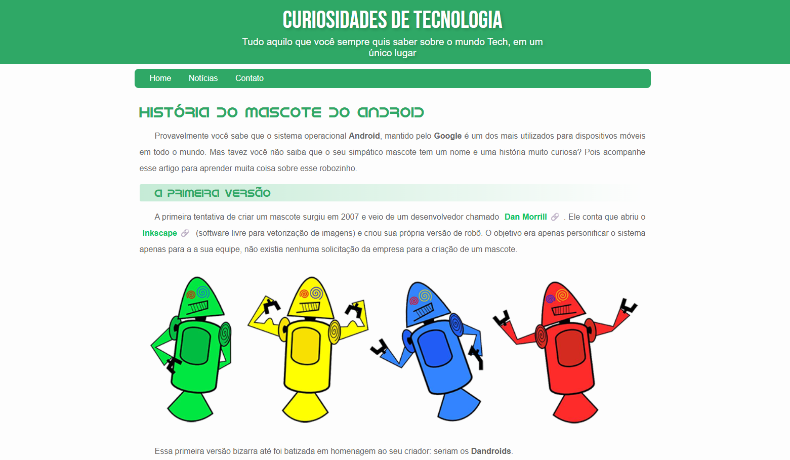

# Android Mascot History Page

A simple and responsive webpage about the **history of the Android mascot**, originally created as part of a beginner HTML and CSS course by [Curso em Vídeo](https://www.youtube.com/user/cursosemvideo), and later modernized with a refreshed design and improved styling.

## 🌐 Project Overview

This project presents the origins of the Android mascot through an article-style page. It includes:

- Informative sections about the first mascots (DanDroids and Bugdroid)
- Responsive images with `<picture>` tags
- An embedded YouTube video
- A modernized CSS design using custom fonts, variables, and layout improvements

## 📁 Project Structure

```
PROJETO-ANDROID/
├── estilo/
│   └── style.css             # Modernized stylesheet
├── fontes/
│   └── idroid.otf            # Custom Android font
├── imagens/
│   └── *.png / *.jpg / favicon.ico  # Project media
├── index.html                # Main HTML file
└── LICENSE                   # License (if any)
```

## 💡 Features

- ✅ Responsive layout for desktop and mobile
- ✅ Custom fonts and variables for consistent theming
- ✅ Semantic HTML and accessible markup
- ✅ Updated and cleaner visual design

## 📸 Preview



## 🛠️ Technologies Used

- HTML5
- CSS3
- Google Fonts
- Custom Fonts (`idroid.otf`)

## 🚀 How to Run

1. Clone this repository:
   ```bash
   git clone https://github.com/your-username/projeto-android.git
   ```

2. Open `index.html` in your browser.

> No build tools required — it's a pure HTML/CSS static site.

## 📚 Credits

Original layout and content by:  
[Gustavo Guanabara](https://gustavoguanabara.github.io/) - [Curso em Vídeo](https://www.cursoemvideo.com/)

Design modernization by:  
[Gustavo Ávila](https://github.com/gusavila)

## 📄 License

This project is for educational purposes. Please refer to the LICENSE file if applicable.
